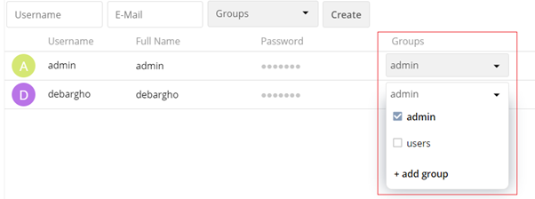

# Overview

ownCloud is an open-source software which allows you to sync, share and collaborate files and content with your team. This helps a team to seamlessly work on data from anywhere and on any device. Some of the major features of ownCloud are:

*   Flexible and secure sharing of files and folders.
*   Collaborate remotely in real time irrespective of the platform.
*   Access, edit and share documents from mobile devices.
*   Share files directly from the file manager using the Virtual file system to save storage and bandwidth.
*   Prevent conflicts while editing by locking the files to ensure better productivity.

In this guide, we will learn how to install, configure, administer and connect to the ownCloud server.


# Installation  

In this section we will learn how to install ownCloud using a Docker Image running on a single Ubuntu 18.04 LTS machine. This helps you to install and set up the ownCloud server quickly and easily. If you prefer the manual installation process please refer to the detailed [Admin Manual](https://doc.owncloud.org/server/10.5/admin_manual/installation/).


## Prerequisites

Note: If you are already using Ubuntu 18.04 and have Docker installed you can skip these steps.  

1. Check the version of Ubuntu running the following command:

    ```
    $ lsb_release -a
    ```
    The output will look like:

    ```
    No LSB modules are available.
    Distributor ID: Ubuntu
    Description:    Ubuntu 18.04.5 LTS
    Release:        18.04
    Codename:       bionic

    ```

2. Check if Docker is installed by running the following command:

    ```
    $ docker
    ```
    The output will look like:

    ```  
   Usage:  docker [OPTIONS] COMMAND

   A self-sufficient runtime for containers

   Options:
      --config string      Location of client config files (default "/home/debargho/.docker")
     -c, --context string     Name of the context to use to connect to the daemon (overrides DOCKER_HOST env var and
                           default context set with "docker context use")
   -D, --debug              Enable debug mode
   -H, --host list          Daemon socket(s) to connect to
   -l, --log-level string   Set the logging level ("debug"|"info"|"warn"|"error"|"fatal") (default "info")
      --tls                Use TLS; implied by --tlsverify
      --tlscacert string   Trust certs signed only by this CA (default "/home/debargho/.docker/ca.pem")
      --tlscert string     Path to TLS certificate file (default "/home/debargho/.docker/cert.pem")
      --tlskey string      Path to TLS key file (default "/home/debargho/.docker/key.pem")
      --tlsverify          Use TLS and verify the remote
   -v, --version            Print version information and quit

    ```

# Install and Configure

 If docker is not installed you have to install docker. Follow the steps given below:

1. Create a project folder and navigate to the folder by executing the following commands:

    ```
    $ mkdir docker_install
    $ cd docker_install
    ```


2. Next, download the `docker-compose.yml` file from the ownCloud GitHub repository by running the following command:

    ```
    $ wget https://raw.githubusercontent.com/owncloud/docs/master/modules/admin_manual/examples/installation/docker/docker-compose.yml

    --2021-04-19 06:50:56--  https://raw.githubusercontent.com/owncloud/docs/master/modules/admin_manual/examples/installation/docker/docker-compose.yml
     Resolving raw.githubusercontent.com (raw.githubusercontent.com)... 185.199.108.133, 185.199.110.133, 185.199.109.133, ...
     Connecting to raw.githubusercontent.com (raw.githubusercontent.com)|185.199.108.133|:443... connected.
     HTTP request sent, awaiting response... 200 OK
     Length: 1676 (1.6K) [text/plain]
    Saving to: ‘docker-compose.yml’

     docker-compose.yml            100%[=================================================>]   1.64K  --.-KB/s    in 0s

     2021-04-19 06:50:57 (16.7 MB/s) - ‘docker-compose.yml’ saved [1676/1676]
    ```


3. Create a .env file by executing the following command:

   `$ nano .env`

    Copy the following environment configuration:

   ```
    OWNCLOUD_VERSION=latest
    OWNCLOUD_DOMAIN=localhost
    ADMIN_USERNAME=admin
    ADMIN_PASSWORD=admin
   ```

Save the configuration.

4. If you do not have docker-compose installed, install it by running the following command:

```
$ sudo apt install docker-compose
```

After installing use the `docker-compose` CLI tool to build and start the container by running the following command:

```
$ docker-compose up -d
```

5. Now verify the status of the processes to determine the server is up and running. Execute the following command:
```
$ docker-compose ps
```

The output will look like:
```
         Name                            Command               State           Ports
-------------------------------------------------------------------------------------------------
owncloudserverdocker_db_1         /usr/bin/entrypoint /bin/s ...   Up      3306/tcp
owncloudserverdocker_owncloud_1   /usr/bin/entrypoint /usr/b ...   Up      0.0.0.0:8080->8080/tcp
owncloudserverdocker_redis_1      /usr/bin/entrypoint /bin/s ...   Up      6379/tcp
```  

Now that the installation is done, you can test the docker image to verify and open ownCloud on the web.

# Test Docker Image

To quickly test the docker image follow the steps below:


1. Download the official docker image for ownCloud server latest version by running the following command:

    ```
    $ docker pull owncloud/server:latest
    ```

2. Once the image is downloaded run the image on port 8080 by executing the following command:

    ```
    $ docker run -p8080:8080 owncloud/server:latest
    ```

Once the apache demon starts enter [http://localhost:8080](http://localhost:8080) on your preferred browser. The following screen will appear:


# Administration

In this section, we will learn about administration workflows like:

*   Allow access to the server using IP address and port number
*   Add a user account

## Allow Access to Server

Once the ownCloud server is up and running with default environment values, you can access it using your browser. Follow the steps below:

1. Enter [http://localhost:8080](http://localhost:8080) on your preferred browser. The login page appears, enter the username and password as configured in the .env file. The default is admin/admin. Refer to the image below:


2. The Home screen appears as shown below:
 


3. Skip the message for installing desktop and mobile clients. The files page is displayed as shown below:


## Add user Account

To create a user account follow the steps given below:

1. Login to the ownCloud server using admin credentials. Click the Admin drop-down at the top-right corner of the screen and select Users. Refer to the image below: 


2. The screen with the list of users appears as shown below: 


3. Enter the Username and E-mail in the respective text boxes and click Create as shown below:   


4. Once the user is created it will appear in the list as shown below:    


After the user is created the user will receive an email with the username and a system generated password.

5. You can assign the user to a group from the Groups drop-down as shown below:



# Connect to ownCloud server

As an end user, you can access the ownCloud server from any modern web browsers and compatible device. In order to connect and use ownCloud efficiently, it is  recommended to download and install the desktop and/or the mobile applications (clients). In this section we will learn the easiest way to _connect to the ownCloud server from different clients_.

## Web UI

To access ownCloud server from the web and follow the steps below:

1. Open a tab from any browser.
2. Enter the server URL, or the server's IP address and port number.
3. Enter the login credentials.
4. Start using the web interface. Refer to the image below:


You can now start using the web UI by uploading documents and sharing files.

## Desktop

To start using the ownCloud desktop client for Windows, Mac OS and Linux download the respective desktop client from [here](https://owncloud.com/desktop-app/).  For Linux users installation steps depend on the specific distribution. For more details click [here](https://software.opensuse.org/download/package?project=isv:ownCloud:desktop&package=owncloud-client).

In this guide we will see how to install the desktop client using the installation wizard. Follow the steps given below:

1. After downloading run the wizard. Enter the URL the server of your ownCloud and click Next as shown below:


2. Enter the login credentials, and click Next as shown below:


3. Select the respective folders and files in your local machine to sync with server and click Connect as shown below:


For more details on installation, configuration, and usage of the desktop client, click [here](https://doc.owncloud.com/desktop/). 

## Android

You can also start using ownCloud on your Android devices. Follow the steps given below:

1. Download the [Android](https://owncloud.com/mobile-apps/) application.
2. Install the application similar to any other app. After successful installation, a New Features Wizard screen appears as shown below:


3. Enter the server’s URL and the username and password to log in to the application.


If a message appears about trusting the server's certificates, click Yes.


4. Start using the app as shown below:


For more information, refer to [ownCloud - Android](https://doc.owncloud.com/android/).

## iOS

You can also start using ownCloud on your iOS devices. Follow the steps given below:

1. Download the [iOS](https://owncloud.com/mobile-apps/) application. 
2. Install the application similar to any other app on your phone.
3. Enter the server’s URL and the username and password to log in to the application. \


If a message appears about trusting the server's certificates, click Yes.


4. Start using the app, starting at the Files screen as shown below:


For more information, refer to [ownCloud - iOS](https://doc.owncloud.com/ios/).

